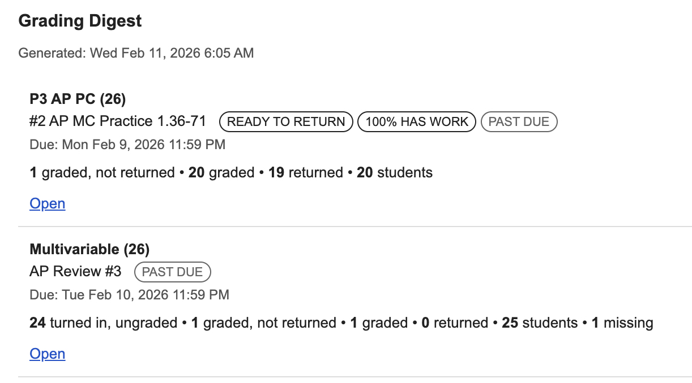

# Google Classroom Work Review Digest

Google Apps Script that scans your active Google Classroom courses and emails a grading digest with assignments that need attention.

## What It Does

The main function is `generateGradingDigest()` in `Code.gs`.  
When it runs, it:

1. Loads active courses where you are the teacher.
2. Checks coursework and student submissions.
3. Builds an "actionable items" list.
4. Emails an HTML digest to your own account.

Email subject format:

`Grading Digest: <N> item(s) need attention`

## What Counts as "Needs Attention"

An assignment is included if one or more of these are true:

- Turned in but ungraded (`TURNED_IN` and no grade).
- Graded but not returned.
- Missing work (past due only, and no draft work evidence).
- Ready to return: all students graded, but not all returned.
- Pre-due exception: everyone has work submitted/uploaded, but grading is incomplete.

## Current Default Behavior

From `CONFIG` in `generateGradingDigest()`:

- `lookbackDays: 5` (ignore older due dates).
- `onlyPastDue: true` (focus on past-due items).
- `includeMissing: true`.
- `includeUndated: false`.
- `includeReadyToReturn: true`.
- `countDraftUploadsAsSubmitted: true`.
- `maxItemsInEmail: 100`.
- Weekends are skipped (Saturday/Sunday).

## Setup

1. Open a Google Apps Script project and paste `Code.gs`.
2. In Apps Script, open **Services** and add `Google Classroom API`.
3. If prompted, allow/enable the linked Google Cloud API access (usually guided automatically).
4. Run `generateGradingDigest()` once manually and approve permissions.
5. Add a time-driven trigger for `generateGradingDigest()` (for example, weekdays each morning).

## Using This As Another Teacher

- No personal email or user ID is hard-coded.
- The script uses `teacherId: "me"` and sends to `Session.getActiveUser().getEmail()`, so it runs for the account that authorizes it.
- Each teacher should authorize the script with their own Google account and create their own trigger.

## New School Year Notes / Troubleshooting

In most cases, no code changes should be necessary for a new school year.
The script pulls your `ACTIVE` courses dynamically and runs as the account that authorized it.

If it stops working, check these first:

1. In Apps Script, run `generateGradingDigest()` manually once and confirm all permission prompts are approved.
2. Confirm **Google Classroom API** is still added under **Services** in the script project.
3. Verify your time-driven trigger for `generateGradingDigest()` still exists and is enabled.
4. Check the script time zone and trigger run time in Apps Script settings.
5. Confirm your new classes are in `ACTIVE` state and you are listed as a teacher.
6. If digest emails are unexpectedly empty, review `lookbackDays` (default `5`) and `onlyPastDue` (default `true`) in `CONFIG`.
7. Check the Apps Script **Executions** log for the latest error message and re-authorize the script if prompted.

## Screenshot

## Notes

- Digest is sent to `Session.getActiveUser().getEmail()`.
- Due dates without a due time are treated as due at `23:59`.
- Assignments without due dates are excluded by default.
- The digest includes this plain instruction line: `Use Classroom SIS Export extension to synch to SIS.`

## File

- `Code.gs`: full script implementation.
